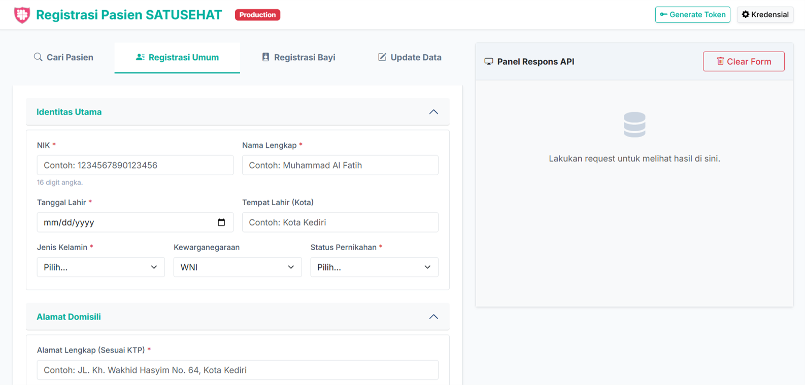
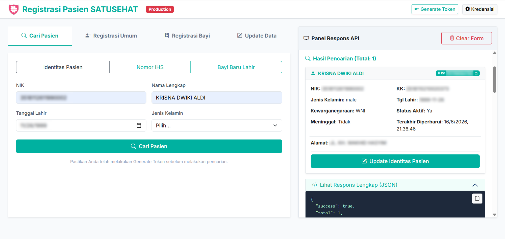
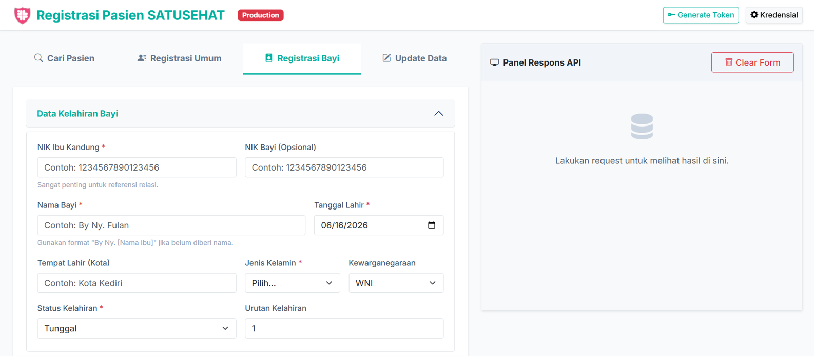
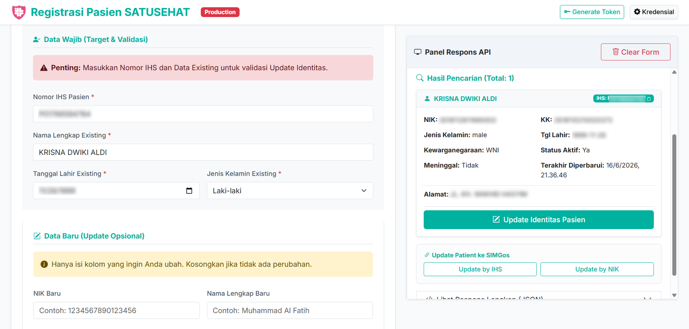

# Registrasi Pasien Satu Sehat (Web Version)

Aplikasi berbasis web untuk pencarian, pendaftaran, dan pembaruan data pasien pada platform SATUSEHAT Kementerian Kesehatan RI. Mendukung integrasi dengan **SIMGos** untuk pengambilan data pasien secara otomatis. Dibangun menggunakan PHP Native, HTML5, Bootstrap 5, dan JavaScript murni.



## Fitur Utama

1. **Pencarian Pasien** — Cari berdasarkan Identitas (NIK/Nama/Tgl Lahir/JK), Nomor IHS, atau NIK Ibu (Bayi). Hasil pencarian menampilkan data lengkap dan tombol **Update Identitas Pasien**.

2. **Integrasi SIMGos** — Ambil data pasien dari SIMGos RS berdasarkan No. RM + Tanggal Lahir. Tersedia di tab Cari Pasien, Registrasi Umum, dan Registrasi Bayi dengan auto-fill cerdas.

3. **Registrasi Pasien Umum** — Alur otomatis: cari berdasarkan NIK → jika sudah terdaftar tampilkan IHS → jika belum, buat pasien baru.

4. **Registrasi Bayi Baru Lahir** — Formulir khusus menggunakan referensi NIK Ibu Kandung sesuai standar FHIR SATUSEHAT.

5. **Update Data Pasien (PATCH)** — Perbarui data pasien dengan JSON Patch. Hanya field yang diisi yang dikirim ke SATUSEHAT.

6. **Master Data Wilayah** — Cascading dropdown Provinsi → Kab/Kota → Kecamatan → Kelurahan/Desa dengan pencarian TomSelect dan auto-pagination.

7. **Kredensial Dinamis & Auto-Token** — Dukungan lingkungan Staging/Production dengan auto-generate token dari `.env`.

8. **Human-Readable Response** — Respons API ditampilkan dalam format yang mudah dipahami dengan detail diagnostik jika terjadi kesalahan.

## Persyaratan Sistem

- PHP 8.1+
- Ekstensi PHP: `curl`, `session`

## Cara Menjalankan

1. Clone folder aplikasi ke komputer Anda.

2. Salin `.env.example` menjadi `.env`, isi kredensial:

   ```env
   # SATUSEHAT
   STAGING_CLIENT_ID=your_staging_client_id
   STAGING_CLIENT_SECRET=your_staging_client_secret
   PRODUCTION_CLIENT_ID=your_production_client_id
   PRODUCTION_CLIENT_SECRET=your_production_client_secret

   # SIMGos (opsional)
   URL_SIMGOS=https://simgos-rsud.example.com
   X_USERNAME=your_simgos_username
   X_PASSWORD=your_simgos_password
   ```

3. Jalankan server:

   ```bash
   php -S localhost:8000
   ```

4. Buka `http://localhost:8000`

## Cara Penggunaan

### Tab 1 – Cari Pasien
> 
> - **Manual:** Isi NIK/Nama/Tgl Lahir/JK, klik **Cari Pasien**
> - **SIMGos:** Klik **Cari Pasien dari SIMGos**, masukkan No. RM + Tanggal Lahir → form terisi otomatis → pencarian SATUSEHAT berjalan otomatis → kartu pasien muncul dengan IHS
> - Klik **Update Identitas Pasien** pada kartu hasil untuk pindah ke tab Update Data

### Tab 2 – Registrasi Umum
> 
> - **SIMGos:** Klik tombol SIMGos → seluruh form terisi otomatis (identitas, demografi, wilayah, kontak)
> - **Manual:** Lengkapi data, klik **POST Patient Umum**

### Tab 3 – Registrasi Bayi
> 
> - **SIMGos:** Klik tombol SIMGos → data bayi terisi otomatis (NIK, Nama, Tgl Lahir, JK, wilayah)
> - **Manual:** Isi data bayi, klik **POST Patient Bayi**

### Tab 4 – Update Pasien
> 
> - **Otomatis:** Dari hasil pencarian, klik "Update Identitas Pasien" → IHS, Nama, Tgl Lahir, JK terisi
> - **Manual:** Masukkan IHS + Data Wajib, isi field yang ingin diubah, klik **PATCH Data Pasien**

## Auto-fill SIMGos

| Data | Umum | Bayi |
|------|------|------|
| NIK | ✓ | ✓ |
| Nama | NAMA saja (tanpa Gelar) | "BY NY" + NAMA |
| Tanggal Lahir | ✓ | ✓ |
| Jenis Kelamin | ✓ | ✓ |
| Wilayah (Cascade Kodewilayah) | ✓ | ✓ |
| RT/RW (Padding 3 digit) | ✓ | ✓ |
| Status Nikah Mapping deskripsi → S/M/D/W | ✓ | — |
| Kewarganegaraan | ✓ | ✓ |
| Kontak | ✓ | ✓ |

**Keamanan:** Kredensial SIMGos hanya dibaca dari `.env` di sisi server, tidak pernah dikirim via browser.

## Struktur Direktori

```text
satusehat/
├── api/
│   ├── clear_session.php
│   ├── generate_token.php
│   ├── get_wilayah.php
│   ├── patch_pasien.php
│   ├── post_pasien_bayi.php
│   ├── post_pasien_umum.php
│   ├── search_pasien.php
│   └── simgos_get_pasien.php      
├── assets/
│   ├── css/style.css
│   ├── img/
│   |   ├── cari-pasien.png
│   |   ├── register-bayi.png
│   |   ├── register-umum.png
│   |   └── update-pasien.png
│   └── js/main.js
├── includes/
│   ├── config.php
│   ├── functions.php
│   ├── logger.php
│   └── satusehat.php
├── logs/app.log
├── .env
├── .env.example
├── favicon.ico
├── favicon.png
├── index.php
└── README.md
```

## Alur Pencarian Pasien dari SIMGos

```text
No. RM + Tanggal Lahir
        │
        ▼
SIMGos getToken → getPasien
        │
   ┌────┴────┐
   ▼         ▼
Ditemukan  Tidak ditemukan
   │         │
   ▼         ▼
Auto-fill  Error
   │
   ▼
[Cari Pasien] Auto-trigger SATUSEHAT
   │
   ▼
Kartu Pasien (IHS + data lengkap)
   │
   ▼
"Update Identitas Pasien"
   │
   ▼
Tab Update terisi otomatis
```

## Referensi

[SATUSEHAT Platform – Master Patient Index (MPI)](https://satusehat.kemkes.go.id/platform/docs/id/master-data/master-patient-index/preliminary/)

> Spesifikasi SATUSEHAT dapat berubah sewaktu-waktu. Sesuaikan implementasi jika terdapat pembaruan dari Kementerian Kesehatan RI.
